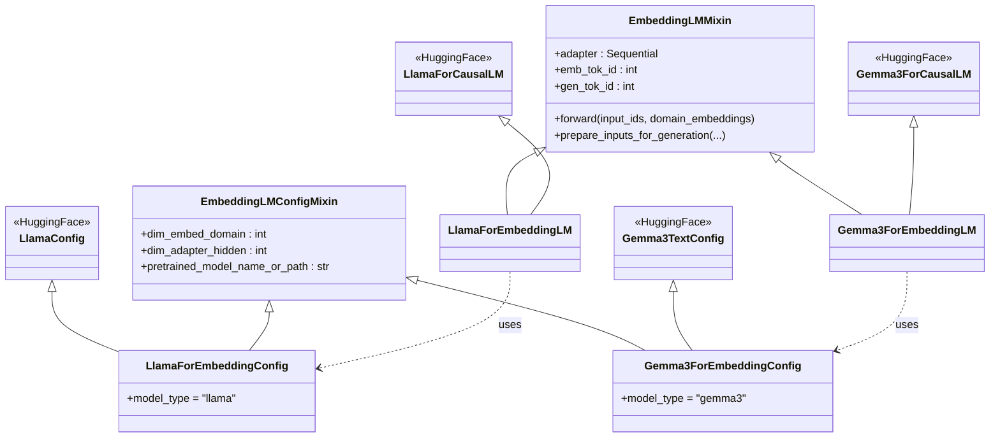
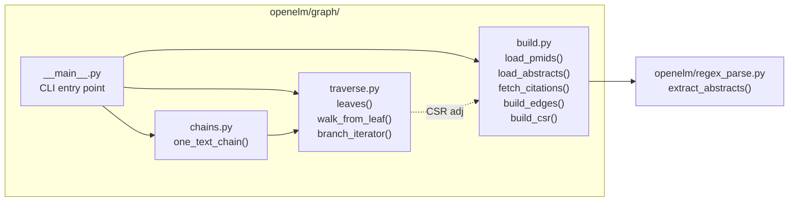
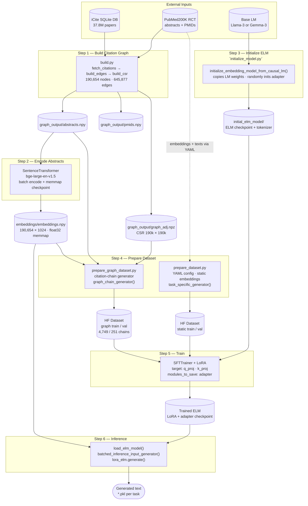

# ctELM Architecture

## 1. Model Class Hierarchy (`openelm/model.py`)

The `adapter` inside `EmbeddingLMMixin` is:
`Linear(domain_dim → adapter_hidden) → ReLU → Linear(adapter_hidden → token_dim)`

In `forward()`, any position where `input_ids == emb_tok_id` has its token embedding replaced by `adapter(domain_embedding[i])` before being passed to the transformer layers.

---

## 2. Graph Module Internals (`openelm/graph/`)

---

## 3. End-to-End Data & Training Pipeline

