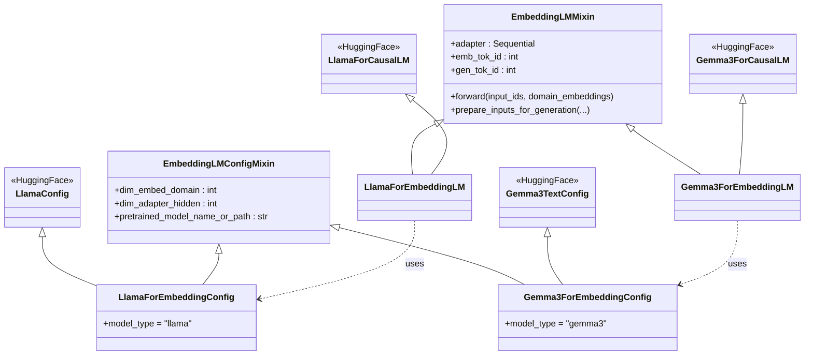
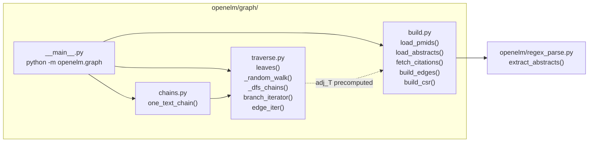
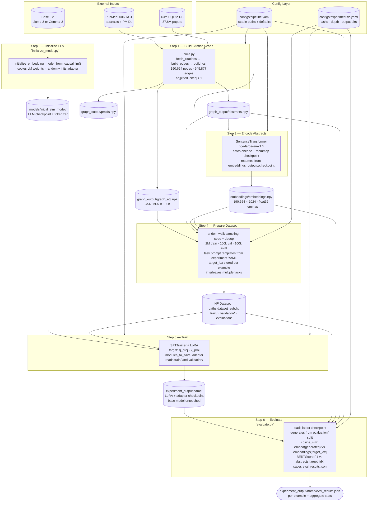

# ctELM Architecture

## 1. Model Class Hierarchy (`openelm/model.py`)



The `adapter` inside `EmbeddingLMMixin` is:
`Linear(domain_dim → adapter_hidden) → ReLU → Linear(adapter_hidden → token_dim)`

In `forward()`, any position where `input_ids == emb_tok_id` has its token embedding replaced by `adapter(domain_embedding[i])` before being passed to the transformer layers. Multiple `emb_tok` positions are filled in order, so the i-th `emb_tok` in the sequence receives the i-th domain embedding.

Special tokens per model family (`openelm/tokens_map.py`):

| Family | `emb_tok` | `gen_tok` |
|---|---|---|
| Llama-3.x | `<\|reserved_special_token_0\|>` (id 128002) | `<\|reserved_special_token_1\|>` (id 128003) |
| Gemma-3 / MedGemma | `<unused0>` (id 6) | `<unused1>` (id 7) |

---

## 2. Config System (`openelm/config.py`)

All pipeline scripts accept `--config` (default: `configs/pipeline.yaml`) and an optional `--experiment` overlay. The experiment YAML is deep-merged on top of the base using OmegaConf — only keys present in the experiment file are overridden.

```
configs/
  pipeline.yaml              ← stable: paths, model, hyperparams
  experiments/
    chain1_reconstruct.yaml  ← 1 ancestor, target embedding included
    chain1_generate.yaml     ← 1 ancestor, target embedding withheld
    chain2_reconstruct.yaml  ← 2 ancestors, target embedding included
    chain2_generate.yaml     ← 2 ancestors, target embedding withheld
    chain3_reconstruct.yaml  ← 3 ancestors, target embedding included
    chain3_generate.yaml     ← 3 ancestors, target embedding withheld
    chain4_reconstruct.yaml  ← 4 ancestors, target embedding included
    chain4_generate.yaml     ← 4 ancestors, target embedding withheld
```

**`pipeline.yaml` top-level sections:**

| Section | Purpose |
|---|---|
| `paths` | Shared filesystem roots: `graph_outputd`, `embeddings_outputd`, `dataset_subdir` |
| `graph_build` | Inputs for `openelm/graph/__main__.py`: txt, pmidf, db paths |
| `embed_abstracts` | Encoder model, batch size, checkpoint interval, `embed_dim` |
| `prepare_graph_dataset` | Base model (tokenizer), depth, seed, `n_train`, `n_val`, `n_eval` |
| `eval` | Generation params: `batch_size`, `max_new_tokens`, `repetition_penalty` |
| `train` | Base model path, output dir, LoRA training hyperparams |

**Experiment YAMLs** own the keys that vary between runs: `prepare_graph_dataset.tasks` (prompt templates), `prepare_graph_dataset.depth`, `paths.dataset_subdir`, and `train.output_dir`. The base pipeline config never defines tasks — those are experiment-specific.

---

## 3. Graph Module (`openelm/graph/`)

### Edge Convention

`adj[cited_idx, citing_idx] = 1`

Row `i` of `adj` contains all papers in the 200k set that **cite** paper `i`. This means:
- **Out-degree of row i** = number of papers that cite paper i
- **Leaves** (`out-degree == 0`) = papers no other paper in the 200k set cites = the **most recent** papers
- **adj_T[j, i] = 1** means paper `j` cites paper `i` (j is newer than i)

### Traversal (`traverse.py`)

`branch_iterator` walks backward through time from each leaf. It has two modes:

**Seeded (random sampling, used in practice):** picks a random leaf, performs a random walk backwards through `adj_T` for `depth` hops, and records the chain. Chains are deduplicated via `.tobytes()` hash. Stops at `max_chains`. This is the mode used by `prepare_graph_dataset.py` — the chain space is combinatorially enormous so exhaustive enumeration is not feasible.

**Unseeded (exhaustive DFS):** a stack-based DFS from every leaf that yields all complete paths of exactly `depth` hops. Used for analysis or small graphs.

In both modes, paths are reversed before yielding → **chain is ordered oldest → newest**, `chain[-1]` is always the leaf (most recent / citing paper).



**`edge_iter(adj)`** yields every `[parent, child]` pair from the CSR as a convenience iterator (used for downstream tasks such as Tutte embedding).

### Chain Structure

```
chain = [root, ..., chain[-2], chain[-1]]
         oldest            cited   citing
```

For a depth-1 chain: `chain = [cited_paper, citing_paper]`
- `chain[0]` — the cited paper (older)
- `chain[-1]` — the citing paper (newer); its abstract is the generation target; its index is stored as `target_idx` in the dataset for eval lookup

---

## 4. End-to-End Data & Training Pipeline



---

## 5. Experiment System

Each experiment is a YAML file in `configs/experiments/` that overrides a minimal set of keys from `pipeline.yaml`. The base config never changes between experiments.

### Running an experiment (Bouchet / SLURM)

One-time setup (after transferring `graph_output/` from local):

```bash
sbatch scripts/embed.sh                                            # 1× H100, up to 2h
```

Per-experiment pipeline:

```bash
sbatch scripts/prepare_dataset.sh configs/experiments/<name>.yaml  # CPU, up to 48h
sbatch scripts/train.sh           configs/experiments/<name>.yaml  # 2× H100, up to 48h
sbatch scripts/evaluate.sh        configs/experiments/<name>.yaml  # 1× H100, up to 4h
```

Outputs are isolated per experiment via:
- `paths.dataset_subdir` → separate HF dataset directory under `graph_output/`
- `train.output_dir` → separate LoRA checkpoint + `eval_results.json` under `experiment_output/`

The base model at `models/initial_elm_model/` is read-only and shared across all experiments — only the small LoRA adapter weights are written per run.

### Dataset Split

All experiments use the same counts (set in `pipeline.yaml`, overridable per experiment):

| Split | Size | Used by |
|---|---|---|
| `train/` | 2,000,000 | `train.py` |
| `validation/` | 100,000 | `train.py` (eval during training) |
| `evaluation/` | 100,000 | `evaluate.py` (post-training metrics) |

### Defined Experiments

Two modes per chain length:
- **Reconstruct** (`include_target_embedding: true`) — all chain papers embedded; model reproduces the target abstract
- **Generate** (`include_target_embedding: false`) — only `chain[:-1]` embedded; model must produce novel output for the unseen citing paper

Chain number = number of ancestor papers in the lineage (excluding the target).

| Experiment | Ancestors | Depth | Input embeddings | Mode |
|---|---|---|---|---|
| `chain1_reconstruct` | 1 | 1 | 2 | Reconstruct |
| `chain1_generate` | 1 | 1 | 1 | Generate |
| `chain2_reconstruct` | 2 | 2 | 3 | Reconstruct |
| `chain2_generate` | 2 | 2 | 2 | Generate |
| `chain3_reconstruct` | 3 | 3 | 4 | Reconstruct |
| `chain3_generate` | 3 | 3 | 3 | Generate |
| `chain4_reconstruct` | 4 | 4 | 5 | Reconstruct |
| `chain4_generate` | 4 | 4 | 4 | Generate |

All use the same generation target: `abstracts[chain[-1]]` (the most recent / citing paper's abstract).

### Evaluation Metrics (`evaluate.py`)

| Metric | How |
|---|---|
| **Cosine similarity** | `bge-large-en-v1.5` embedding of generated text vs `embeddings[target_idx]` |
| **BERTScore F1** | generated text vs `abstracts[target_idx]` via `evaluate` library |

Results saved to `experiment_output/<name>/eval_results.json` with per-example scores and aggregate mean ± std.

---

## 6. Filesystem Layout (Bouchet)

```
ctELM-with-graph-time-embeddings/
├── configs/
│   ├── pipeline.yaml
│   └── experiments/
│       ├── cite_pair.yaml
│       ├── cite_pair_temporal.yaml
│       ├── cite_pair_instruct.yaml
│       ├── chain_depth2.yaml
│       ├── chain_depth2_instruct.yaml
│       └── chain_depth5.yaml
├── models/                        ← symlink → shared model store
│   ├── initial_elm_model/
│   └── 5tasks_full_tuning_lora_outputs/
├── graph_output/                  ← transferred from local build
│   ├── graph_adj.npz
│   ├── abstracts.npy
│   ├── pmids.npy
│   └── dataset_<name>/            ← written by prepare_dataset.sh
│       ├── train/
│       ├── validation/
│       └── evaluation/
├── embeddings/                    ← transferred from local encode
│   └── embeddings.npy
├── experiment_output/             ← symlink → scratch (auto-scrubbed 60d)
│   └── <name>/                    ← written by train.sh + evaluate.sh
│       ├── checkpoint-*/
│       └── eval_results.json
├── scripts/
│   ├── embed.sh                   ← SLURM GPU job (1× H100, 2h) — one-time
│   ├── prepare_dataset.sh         ← SLURM CPU job (48h)
│   ├── train.sh                   ← SLURM GPU job (2× H100, torchrun, 48h)
│   └── evaluate.sh                ← SLURM GPU job (1× H100, 4h)
└── logs/
```
