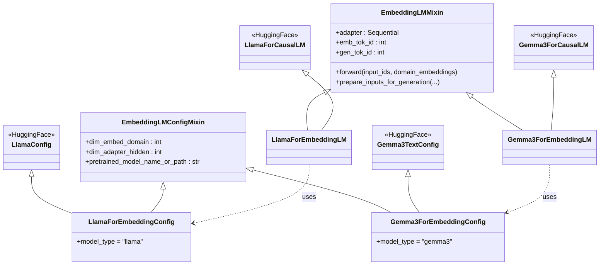
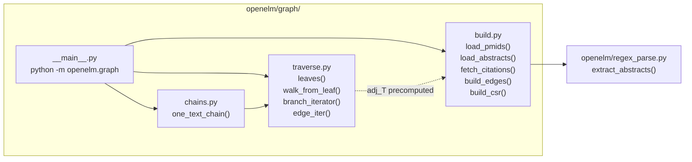
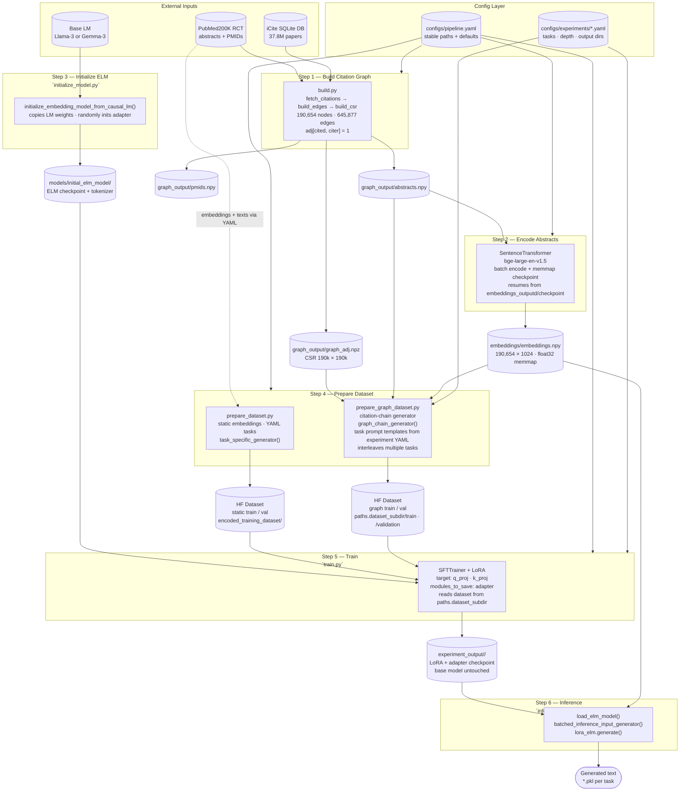

# ctELM Architecture

## 1. Model Class Hierarchy (`openelm/model.py`)



The `adapter` inside `EmbeddingLMMixin` is:
`Linear(domain_dim → adapter_hidden) → ReLU → Linear(adapter_hidden → token_dim)`

In `forward()`, any position where `input_ids == emb_tok_id` has its token embedding replaced by `adapter(domain_embedding[i])` before being passed to the transformer layers. Multiple `emb_tok` positions are filled in order, so the i-th `emb_tok` in the sequence receives the i-th domain embedding.

Special tokens per model family (`openelm/tokens_map.py`):

| Family | `emb_tok` | `gen_tok` |
|---|---|---|
| Llama-3.x | `<\|reserved_special_token_0\|>` (id 128002) | `<\|reserved_special_token_1\|>` (id 128003) |
| Gemma-3 / MedGemma | `<unused0>` (id 6) | `<unused1>` (id 7) |

---

## 2. Config System (`openelm/config.py`)

All pipeline scripts accept `--config` (default: `configs/pipeline.yaml`) and an optional `--experiment` overlay. The experiment YAML is deep-merged on top of the base using OmegaConf — only keys present in the experiment file are overridden.

```
configs/
  pipeline.yaml              ← stable: paths, model, hyperparams
  experiments/
    cite_pair.yaml           ← overrides: depth, tasks, output dirs
    <future_experiment>.yaml
```

**`pipeline.yaml` top-level sections:**

| Section | Purpose |
|---|---|
| `paths` | Shared filesystem roots: `graph_outputd`, `embeddings_outputd`, `dataset_subdir` |
| `graph_build` | Inputs for `openelm/graph/__main__.py`: txt, pmidf, db paths |
| `embed_abstracts` | Encoder model, batch size, checkpoint interval, `embed_dim` |
| `prepare_graph_dataset` | Base model (tokenizer), depth, train ratio, chain cap |
| `train` | Base model path, output dir, LoRA training hyperparams |

**Experiment YAMLs** own the keys that vary between runs: `prepare_graph_dataset.tasks` (prompt templates), `prepare_graph_dataset.depth`, `paths.dataset_subdir`, and `train.output_dir`. The base pipeline config never defines tasks — those are experiment-specific.

---

## 3. Graph Module (`openelm/graph/`)

### Edge Convention

`adj[cited_idx, citing_idx] = 1`

Row `i` of `adj` contains all papers in the 200k set that **cite** paper `i`. This means:
- **Out-degree of row i** = number of papers that cite paper i
- **Leaves** (`out-degree == 0`) = papers no other paper in the 200k set cites = the **most recent** papers
- **adj_T[j, i] = 1** means paper `j` cites paper `i` (j is newer than i)

### Traversal (`traverse.py`)

`branch_iterator` walks backward through time from each leaf:

1. Precompute `adj_T = adj.T.tocsr()` once
2. For each leaf node, `walk_from_leaf` follows `adj_T` rows (= references of the current paper) up to `depth` hops, accumulating a path of older and older papers
3. Path is reversed before yielding → **chain is ordered oldest → newest**, `chain[-1]` is always the leaf (most recent / citing paper)



**`edge_iter(adj)`** yields every `[parent, child]` pair from the CSR as a convenience iterator (used for downstream tasks such as Tutte embedding).

### Chain Structure

```
chain = [root, ..., chain[-2], chain[-1]]
         oldest            cited   citing
```

For a depth-1 chain: `chain = [cited_paper, citing_paper]`
- `chain[0]` — the cited paper (older)
- `chain[-1]` — the citing paper (newer); its abstract is the generation target

---

## 4. End-to-End Data & Training Pipeline



---

## 5. Experiment System

Each experiment is a YAML file in `configs/experiments/` that overrides a minimal set of keys from `pipeline.yaml`. The base config never changes between experiments.

### Running an experiment (Bouchet / SLURM)

```bash
# build dataset for this experiment (CPU job)
sbatch scripts/prepare_dataset.sh configs/experiments/<name>.yaml

# train on that dataset (GPU job, 2× H100)
sbatch scripts/train.sh configs/experiments/<name>.yaml
```

Outputs are isolated per experiment via:
- `paths.dataset_subdir` → separate HF dataset directory under `graph_output/`
- `train.output_dir` → separate LoRA checkpoint directory under `experiment_output/`

The base model at `models/initial_elm_model/` is read-only and shared across all experiments — only the small LoRA adapter weights are written per run.

### Defined Experiments

#### `cite_pair` (`configs/experiments/cite_pair.yaml`)

| Key | Value |
|---|---|
| `prepare_graph_dataset.depth` | 1 (2-node chains only) |
| `paths.dataset_subdir` | `dataset_cite_pair` |
| `train.output_dir` | `experiment_output/cite_pair` |

**Task:** Given the semantic embedding of a cited paper and its citing paper, generate the citing abstract.

```
Input:  "Cited paper: <emb_tok> Citing paper: <emb_tok>"
            ↑ emb(chain[0])          ↑ emb(chain[1])
Target: abstract of chain[1]  (the citing paper)
Eval:   cosine_sim(embed(generated_text), emb(chain[1]))
```

The 2-slot prompt template filters `branch_iterator` to chains of exactly length 2, so all training examples are clean cited→citing pairs.

---

## 6. Filesystem Layout (Bouchet)

```
ctELM-with-graph-time-embeddings/
├── configs/
│   ├── pipeline.yaml              ← base config (committed)
│   └── experiments/
│       └── cite_pair.yaml
├── models/                        ← symlink → shared model store
│   ├── initial_elm_model/
│   └── 5tasks_full_tuning_lora_outputs/
├── graph_output/                  ← transferred from local build
│   ├── graph_adj.npz
│   ├── abstracts.npy
│   ├── pmids.npy
│   └── dataset_cite_pair/         ← written by prepare_dataset.sh
│       ├── train/
│       └── validation/
├── embeddings/                    ← transferred from local encode
│   └── embeddings.npy
├── experiment_output/             ← symlink → scratch (auto-scrubbed 60d)
│   └── cite_pair/                 ← written by train.sh
│       └── checkpoint-*/
├── scripts/
│   ├── prepare_dataset.sh         ← SLURM CPU job
│   └── train.sh                   ← SLURM GPU job (2× H100, torchrun)
└── logs/                          ← SLURM stdout/stderr
```
